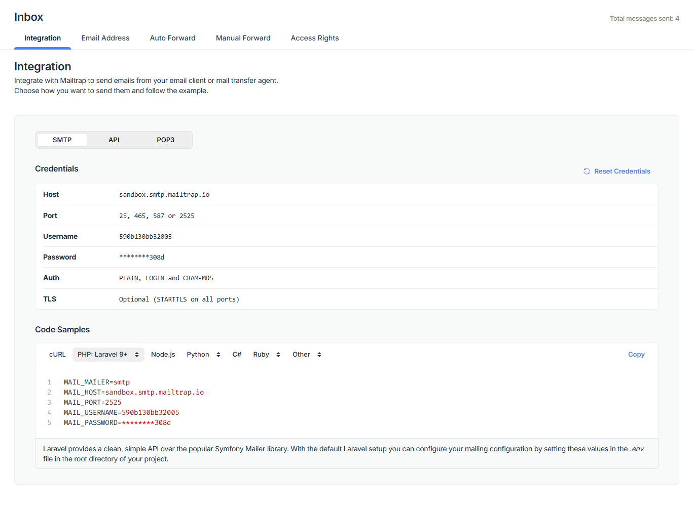

# Requirements
- PHP 8.3^
- MySQL 8
- Composer
- [Mailtrap](https://mailtrap.io/)

# Installation
1. Run ```composer install```
2. Copy ```.env.example``` into ```.env```
3. Run ```php artisan key:generate```
4. Create database named ```topic_indonesia```
5. Open your Mailtrap account and copy credential with Laravel9+ template.
   
6. Copy credential to .env and replace to line 49-53
7. Run ```php artisan migrate:fresh --seed```
8. Run ```php artisan shield:install --fresh``` and follow the instruction, input user ID ```1``` in prompt
9. Run ```php artisan serve```
10. Open ```localhost:8000/admin```
11. Login using:
    - email: superadmin@mail.test
    - password: 123qweasd
